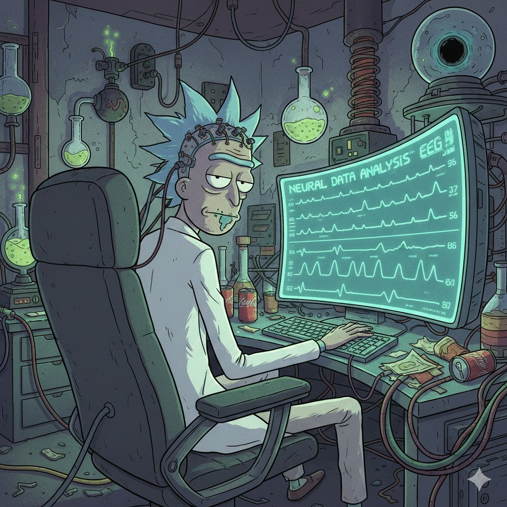

<!-- Improved compatibility of back to top link: See: https://github.com/othneildrew/Best-README-Template/pull/73 -->
<a id="readme-top"></a>
<!--
*** Thanks for checking out the Best-README-Template. If you have a suggestion
*** that would make this better, please fork the repo and create a pull request
*** or simply open an issue with the tag "enhancement".
*** Don't forget to give the project a star!
*** Thanks again! Now go create something AMAZING! :D
-->


<!-- PROJECT SHIELDS -->
<!--
*** I'm using markdown "reference style" links for readability.
*** Reference links are enclosed in brackets [ ] instead of parentheses ( ).
*** See the bottom of this document for the declaration of the reference variables
*** for contributors-url, forks-url, etc. This is an optional, concise syntax you may use.
*** https://www.markdownguide.org/basic-syntax/#reference-style-links
-->
<!-- [![Contributors][contributors-shield]][contributors-url]
[![Forks][forks-shield]][forks-url]
[![Stargazers][stars-shield]][stars-url]
[![Issues][issues-shield]][issues-url]
[![project_license][license-shield]][license-url]
[![LinkedIn][linkedin-shield]][linkedin-url] -->


<!-- PROJECT LOGO -->
<br />

<div>
<h1 align="center">Diploma thesis</h1>

  <p align="center">
    Identification of latent EEG state trajectories based on deep learning methods
    <br />
    <br />
    <a href="https://github.com/Akokotle/diplom/issues/new?labels=bug&template=bug-report---.md">Report Bug</a>
    &middot;
    <a href="https://github.com/Akokotle/diplom/issues/new?labels=enhancement&template=feature-request---.md">Request Feature</a>
  </p>
</div>


<!-- TABLE OF CONTENTS -->
<details>
  <summary>Table of Contents</summary>
  <ol>
    <li>
      <a href="#about-the-project">About The Project</a>
      <ul>
        <li><a href="#built-with">Built With</a></li>
      </ul>
    </li>
    <li>
      <a href="#getting-started">Getting Started</a>
      <ul>
        <li><a href="#environment-setup-using-uv">Environment Setup</a></li>
      </ul>
    </li>
    <li><a href="#usage">Usage</a></li>
    <!-- <li><a href="#roadmap">Roadmap</a></li>
    <li><a href="#contributing">Contributing</a></li>
    <li><a href="#license">License</a></li>
    <li><a href="#contact">Contact</a></li>
    <li><a href="#acknowledgments">Acknowledgments</a></li> -->
  </ol>
</details>


<!-- ABOUT THE PROJECT -->
## About The Project

<div align="center">
    
  </a>
</div>

Welcome! This is a GitHub repository where I will be documenting and saving my work related to my diploma thesis.

<p align="right">(<a href="#readme-top">back to top</a>)</p>

### Built With

* [MNE-Python](https://mne.tools/stable/index.html)


<p align="right">(<a href="#readme-top">back to top</a>)</p>

<!-- GETTING STARTED -->
## Getting Started

### Environment Setup using uv

1.  **Clone the repository:**
    ```bash
    git clone https://github.com/Akokotle/diplom.git
    cd diplom
    ```

2.  **Create and activate the virtual environment with uv:**
    ```bash
    # Create .venv
    uv venv --python 3.13
    # Activate
    source .venv/bin/activate
    ```

3.  **Install dependencies (core and dev) from pyproject.toml:**
    ```bash
    uv pip install -e ".[dev]"
    ```

<p align="right">(<a href="#readme-top">back to top</a>)</p>

<!-- USAGE EXAMPLES -->
## Usage

1.  **Configuration Setup:**

    Before running the scripts, ensure your paths and parameters are correctly defined in config.py:

        DATA_ROOT: Must point to the root directory containing EEG data (for now it's PEEG directory).

        SUBJECT_DIR: Define the list of subject IDs you want to process (for now it's from sub-01 to sub-27).

        CONDITIONS: Define the list of conditions you want to process (for now it's pre, MI-SES, MI-IES, post, follow)

        EVENT_ID, T_MIN, T_MAX, BASELINE: Define the epoch parameters.

        FMIN_PSD, FMAX_PSD, PSD_METHOD: Set the frequency range and method for PSD calculation.

        DR_FREQ_BAND: Define type of the frequency band to use


2. **Step-by-Step Analysis**

    1. Calculate PSD

    This script loads EEG data, creates epochs, and calculates the PSD for each epoch. The results are saved as compressed NumPy archives (.npz) for subsequent steps. [subject_id]_epoch_psd_data.npz files are saved in the PSD_ANALYSIS_RESULTS/PSD_DATA directory.
    ```bash
    python scripts/1_calculate_psd.py
    ```

    2. Plot PSD

    This script averages the PSD across all channels for visualization, and generates a plot comparing different conditions and runs. It generates plots (.png) in the PSD_ANALYSIS_RESULTS/PSD_PLOTS directory.
    ```bash
    python scripts/2_plot_psd.py
    ```

    3. Dimension Reduction (UMAP/PCA)

    This script applies UMAP and PCA and generates an interactive 3D plot. It generates and saves the HTML file to the PSD_ANALYSIS_RESULTS/DR_PLOTS folder.
    ```bash
    python scripts/2_plot_psd.py
    ```

    3. Dimension Reduction (UMAP/PCA), comparison of hyperparameters in notebook

    There is also a notebook `dr_plotting.ipynb` where you can visualize and compare different hyperparameter values.


<p align="right">(<a href="#readme-top">back to top</a>)</p>


<!-- ROADMAP
## Roadmap

- [ ] Feature 1
- [ ] Feature 2
- [ ] Feature 3
    - [ ] Nested Feature

See the [open issues](https://github.com/Akokotle/diplom/issues) for a full list of proposed features (and known issues).

<p align="right">(<a href="#readme-top">back to top</a>)</p> -->


<!-- CONTRIBUTING -->
<!-- ## Contributing

Contributions are what make the open source community such an amazing place to learn, inspire, and create. Any contributions you make are **greatly appreciated**.

If you have a suggestion that would make this better, please fork the repo and create a pull request. You can also simply open an issue with the tag "enhancement".
Don't forget to give the project a star! Thanks again!

1. Fork the Project
2. Create your Feature Branch (`git checkout -b feature/AmazingFeature`)
3. Commit your Changes (`git commit -m 'Add some AmazingFeature'`)
4. Push to the Branch (`git push origin feature/AmazingFeature`)
5. Open a Pull Request

<p align="right">(<a href="#readme-top">back to top</a>)</p> -->

<!-- ### Top contributors:

<a href="https://github.com/Akokotle/diplom/graphs/contributors">
  
</a> -->


<!-- LICENSE
## License

Distributed under the project_license. See `LICENSE.txt` for more information.

<p align="right">(<a href="#readme-top">back to top</a>)</p> -->


<!-- CONTACT
## Contact

Your Name - [@twitter_handle](https://twitter.com/twitter_handle) - email@email_client.com

Project Link: [https://github.com/Akokotle/diplom](https://github.com/Akokotle/diplom)

<p align="right">(<a href="#readme-top">back to top</a>)</p> -->


<!-- ACKNOWLEDGMENTS
## Acknowledgments

* []()
* []()
* []()

<p align="right">(<a href="#readme-top">back to top</a>)</p>
 -->


<!-- MARKDOWN LINKS & IMAGES
<!-- https://www.markdownguide.org/basic-syntax/#reference-style-links -->
<!-- [contributors-shield]: https://img.shields.io/github/contributors/Akokotle/diplom.svg?style=for-the-badge
[contributors-url]: https://github.com/Akokotle/diplom/graphs/contributors
[forks-shield]: https://img.shields.io/github/forks/Akokotle/diplom.svg?style=for-the-badge
[forks-url]: https://github.com/Akokotle/diplom/network/members
[stars-shield]: https://img.shields.io/github/stars/Akokotle/diplom.svg?style=for-the-badge
[stars-url]: https://github.com/Akokotle/diplom/stargazers
[issues-shield]: https://img.shields.io/github/issues/Akokotle/diplom.svg?style=for-the-badge
[issues-url]: https://github.com/Akokotle/diplom/issues
[license-shield]: https://img.shields.io/github/license/Akokotle/diplom.svg?style=for-the-badge
[license-url]: https://github.com/Akokotle/diplom/blob/master/LICENSE.txt
[linkedin-shield]: https://img.shields.io/badge/-LinkedIn-black.svg?style=for-the-badge&logo=linkedin&colorB=555
[linkedin-url]: https://linkedin.com/in/linkedin_username
[product-screenshot]: images/screenshot.png -->
<!-- Shields.io badges. You can a comprehensive list with many more badges at: https://github.com/inttter/md-badges -->
<!-- [Next.js]: https://img.shields.io/badge/next.js-000000?style=for-the-badge&logo=nextdotjs&logoColor=white
[Next-url]: https://nextjs.org/
[React.js]: https://img.shields.io/badge/React-20232A?style=for-the-badge&logo=react&logoColor=61DAFB
[React-url]: https://reactjs.org/
[Vue.js]: https://img.shields.io/badge/Vue.js-35495E?style=for-the-badge&logo=vuedotjs&logoColor=4FC08D
[Vue-url]: https://vuejs.org/
[Angular.io]: https://img.shields.io/badge/Angular-DD0031?style=for-the-badge&logo=angular&logoColor=white
[Angular-url]: https://angular.io/
[Svelte.dev]: https://img.shields.io/badge/Svelte-4A4A55?style=for-the-badge&logo=svelte&logoColor=FF3E00
[Svelte-url]: https://svelte.dev/
[Laravel.com]: https://img.shields.io/badge/Laravel-FF2D20?style=for-the-badge&logo=laravel&logoColor=white
[Laravel-url]: https://laravel.com
[Bootstrap.com]: https://img.shields.io/badge/Bootstrap-563D7C?style=for-the-badge&logo=bootstrap&logoColor=white
[Bootstrap-url]: https://getbootstrap.com
[JQuery.com]: https://img.shields.io/badge/jQuery-0769AD?style=for-the-badge&logo=jquery&logoColor=white
[JQuery-url]: https://jquery.com  --> -->
