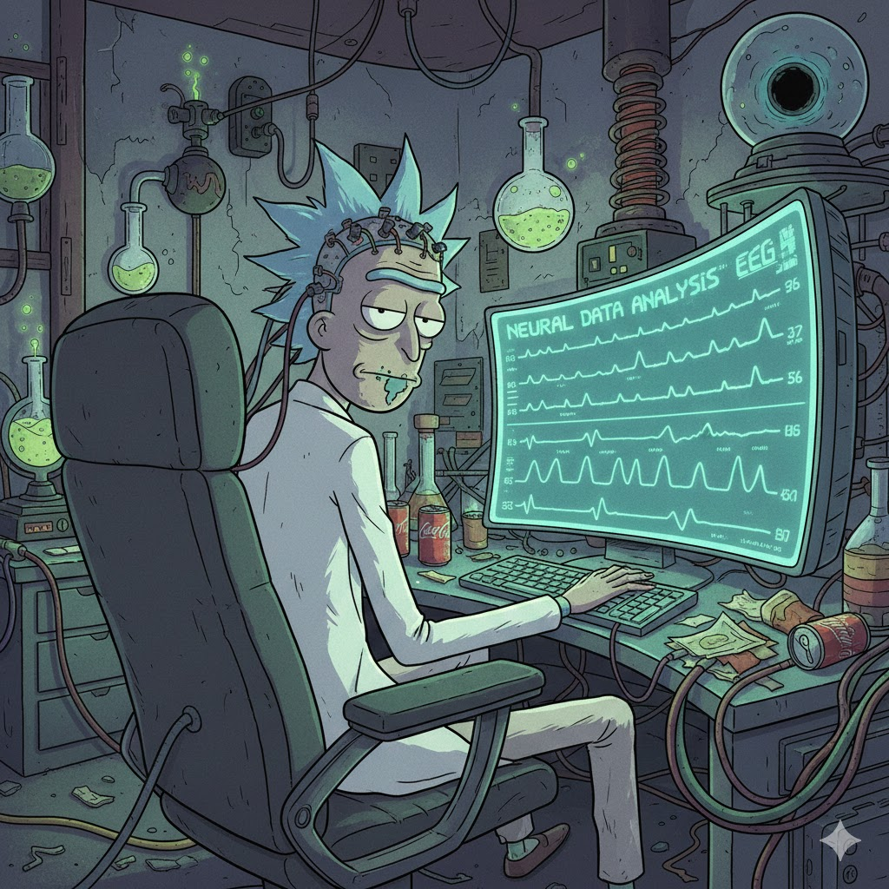

<!-- Improved compatibility of back to top link: See: https://github.com/othneildrew/Best-README-Template/pull/73 -->
<a id="readme-top"></a>
<!--
*** Thanks for checking out the Best-README-Template. If you have a suggestion
*** that would make this better, please fork the repo and create a pull request
*** or simply open an issue with the tag "enhancement".
*** Don't forget to give the project a star!
*** Thanks again! Now go create something AMAZING! :D
-->


<!-- PROJECT SHIELDS -->
<!--
*** I'm using markdown "reference style" links for readability.
*** Reference links are enclosed in brackets [ ] instead of parentheses ( ).
*** See the bottom of this document for the declaration of the reference variables
*** for contributors-url, forks-url, etc. This is an optional, concise syntax you may use.
*** https://www.markdownguide.org/basic-syntax/#reference-style-links
-->
<!-- [![Contributors][contributors-shield]][contributors-url]
[![Forks][forks-shield]][forks-url]
[![Stargazers][stars-shield]][stars-url]
[![Issues][issues-shield]][issues-url]
[![project_license][license-shield]][license-url]
[![LinkedIn][linkedin-shield]][linkedin-url] -->


<!-- PROJECT LOGO -->
<br />

<div>
<h1 align="center">Диплом</h1>

  <p align="center">
    Выявления латентных траекторий ЭЭГ состояний на основе методов глубинного обучения
    <br />
    <br />
    <a href="https://github.com/Akokotle/diplom/issues/new?labels=bug&template=bug-report---.md">Report Bug</a>
    &middot;
    <a href="https://github.com/Akokotle/diplom/issues/new?labels=enhancement&template=feature-request---.md">Request Feature</a>
  </p>
</div>


<!-- TABLE OF CONTENTS -->
<details>
  <summary>Оглавление</summary>
  <ol>
    <li>
      <a href="#о-проекте">О проекте</a>
      <ul>
        <li><a href="#создано-с-использованием">Создано с использованием</a></li>
      </ul>
    </li>
    <li>
      <a href="#начало-работы">Начало работы</a>
      <ul>
        <li><a href="#настройка-окружения">Настройка окружения</a></li>
      </ul>
    </li>
    <li><a href="#использование">Использование</a></li>
    <!-- <li><a href="#roadmap">Roadmap</a></li>
    <li><a href="#contributing">Contributing</a></li>
    <li><a href="#license">License</a></li>
    <li><a href="#contact">Contact</a></li>
    <li><a href="#acknowledgments">Acknowledgments</a></li> -->
  </ol>
</details>


<!-- ABOUT THE PROJECT -->
## О проекте

<div align="center">
    
  </a>
</div>

Добро пожаловать! Это репозиторий GitHub, где я буду документировать и сохранять свою работу, связанную с моей дипломной работой.

<p align="right">(<a href="#readme-top">наверх</a>)</p>

### Создано с использованием

* [MNE-Python](https://mne.tools/stable/index.html)
* [specparam (FOOOF)](https://fooof-tools.github.io/fooof/)
* [UMAP](https://umap-learn.readthedocs.io/en/latest/)

<p align="right">(<a href="#readme-top">наверх</a>)</p>

<!-- GETTING STARTED -->
## Начало работы

### Настройка окружения

1.  **Клонируйте репозиторий:**
    ```bash
    git clone [https://github.com/Akokotle/diplom.git](https://github.com/Akokotle/diplom.git)
    cd diplom
    ```

2.  **Создайте и активируйте виртуальное окружение с помощью uv:**
    ```bash
    # Создание виртуального окружения
    uv venv --python 3.13
    # Активация виртуального окружения
    source .venv/bin/activate
    ```

3.  **Установите зависимости из pyproject.toml:**
    ```bash
    uv pip install -r pyproject.toml --extra dev
    ```

<p align="right">(<a href="#readme-top">наверх</a>)</p>

<!-- USAGE EXAMPLES -->
## Использование

0. **Скачивание данных**
    ```bash
    # Скачивание предобработанных данных
    wget -O eeg_data.rar $(curl -s "https://cloud-api.yandex.net/v1/disk/public/resources/download?public_key=https://disk.360.yandex.ru/d/1obrzctSrN9U4g" | grep -o '"href":"[^"]*"' | cut -d'"' -f4)

    # Скачивание сырых данных
    wget -O eeg_sourcedata.rar $(curl -s "https://cloud-api.yandex.net/v1/disk/public/resources/download?public_key=https://disk.360.yandex.ru/d/W5W1CR4lHmcNlA" | grep -o '"href":"[^"]*"' | cut -d'"' -f4)

    # Разархивирование
    unrar x eeg_data.rar
    unrar x eeg_sourcedata.rar
    ```

1.  **Настройка конфигурации:**

    Перед запуском скриптов убедитесь, что пути и параметры правильно заданы в файле `config.py`:
    *   `DATA_ROOT`: Должен указывать на корневую директорию с данными ЭЭГ (по умолчанию формируется автоматически как `results/PEEG`).
    *   `SUBJECT_DIR`: Список ID испытуемых для обработки (по умолчанию [""] - обрабатываются все доступные, от `sub-01` до `sub-27`).
    *   `CONDITIONS`: Экспериментальные условия (по умолчанию: ["pre", "post", "follow"]).
    *   Также здесь задаются глобальные гиперпараметры для вычисления PSD, UMAP, PCA и SpectralGroupModel.

2. **Пошаговый анализ**

  **1. Предобработка сырых данных**
  Скрипт очищает исходные ЭЭГ-данных. Ход работы включает в себя: удаление каналов, переход на усредненный референс, автоматическую сплайн-интерполяцию удаленных каналов, полосовую и Notch фильтрацию. Сигнал нарезается на эпохи, после чего применяется алгоритм ICA и нейросеть ICLabel для автоматического удаления артефактов. Очищенные эпохи сохраняются в формате `.fif`.
  ```bash
  python scripts/preprocessing.py
  ```

  **2. Спектральная параметризация и выделение пиков**
  Скрипт загружает данные и вычисляет спектральную плотность мощности (PSD). С помощью `specparam` спектр разделяется на периодическую и апериодическую компоненты, после чего извлекаются спектральные пики. Дополнительно вычисляются метрики качества подгонки модели (R-squared, RMSE) и генерируются их тепловые карты по каналам. Извлеченные параметры сохраняются в сжатые архивы NumPy `.npz` и метрики — в `.csv`.
  ```bash
  python scripts/1_extract_peaks.py
  ```

  **3. Снижение размерности (UMAP/PCA) и анализ спектральных сдвигов**
  Скрипт загружает периодику и применяет алгоритмы снижения размерности (UMAP и PCA). Генерируются интерактивные 3D-графики (`.html`) проекций данных для каждого субъекта. Также вычисляются сдвиги между условиями, что визуализируется с помощью топографических карт и групповых тепловых карт.
  ```bash
  python scripts/2_visualize_manifold.py
  ```

<p align="right">(<a href="#readme-top">наверх</a>)</p>


<!-- ROADMAP
## Roadmap

- [ ] Feature 1
- [ ] Feature 2
- [ ] Feature 3
    - [ ] Nested Feature

See the [open issues](https://github.com/Akokotle/diplom/issues) for a full list of proposed features (and known issues).

<p align="right">(<a href="#readme-top">back to top</a>)</p> -->


<!-- CONTRIBUTING -->
<!-- ## Contributing

Contributions are what make the open source community such an amazing place to learn, inspire, and create. Any contributions you make are **greatly appreciated**.

If you have a suggestion that would make this better, please fork the repo and create a pull request. You can also simply open an issue with the tag "enhancement".
Don't forget to give the project a star! Thanks again!

1. Fork the Project
2. Create your Feature Branch (`git checkout -b feature/AmazingFeature`)
3. Commit your Changes (`git commit -m 'Add some AmazingFeature'`)
4. Push to the Branch (`git push origin feature/AmazingFeature`)
5. Open a Pull Request

<p align="right">(<a href="#readme-top">back to top</a>)</p> -->

<!-- ### Top contributors:

<a href="https://github.com/Akokotle/diplom/graphs/contributors">
  
</a> -->


<!-- LICENSE
## License

Distributed under the project_license. See `LICENSE.txt` for more information.

<p align="right">(<a href="#readme-top">back to top</a>)</p> -->


<!-- CONTACT
## Contact

Your Name - [@twitter_handle](https://twitter.com/twitter_handle) - email@email_client.com

Project Link: [https://github.com/Akokotle/diplom](https://github.com/Akokotle/diplom)

<p align="right">(<a href="#readme-top">back to top</a>)</p> -->


<!-- ACKNOWLEDGMENTS
## Acknowledgments

* []()
* []()
* []()

<p align="right">(<a href="#readme-top">back to top</a>)</p>
 -->


<!-- MARKDOWN LINKS & IMAGES
<!-- https://www.markdownguide.org/basic-syntax/#reference-style-links -->
<!-- [contributors-shield]: https://img.shields.io/github/contributors/Akokotle/diplom.svg?style=for-the-badge
[contributors-url]: https://github.com/Akokotle/diplom/graphs/contributors
[forks-shield]: https://img.shields.io/github/forks/Akokotle/diplom.svg?style=for-the-badge
[forks-url]: https://github.com/Akokotle/diplom/network/members
[stars-shield]: https://img.shields.io/github/stars/Akokotle/diplom.svg?style=for-the-badge
[stars-url]: https://github.com/Akokotle/diplom/stargazers
[issues-shield]: https://img.shields.io/github/issues/Akokotle/diplom.svg?style=for-the-badge
[issues-url]: https://github.com/Akokotle/diplom/issues
[license-shield]: https://img.shields.io/github/license/Akokotle/diplom.svg?style=for-the-badge
[license-url]: https://github.com/Akokotle/diplom/blob/master/LICENSE.txt
[linkedin-shield]: https://img.shields.io/badge/-LinkedIn-black.svg?style=for-the-badge&logo=linkedin&colorB=555
[linkedin-url]: https://linkedin.com/in/linkedin_username
[product-screenshot]: images/screenshot.png -->
<!-- Shields.io badges. You can a comprehensive list with many more badges at: https://github.com/inttter/md-badges -->
<!-- [Next.js]: https://img.shields.io/badge/next.js-000000?style=for-the-badge&logo=nextdotjs&logoColor=white
[Next-url]: https://nextjs.org/
[React.js]: https://img.shields.io/badge/React-20232A?style=for-the-badge&logo=react&logoColor=61DAFB
[React-url]: https://reactjs.org/
[Vue.js]: https://img.shields.io/badge/Vue.js-35495E?style=for-the-badge&logo=vuedotjs&logoColor=4FC08D
[Vue-url]: https://vuejs.org/
[Angular.io]: https://img.shields.io/badge/Angular-DD0031?style=for-the-badge&logo=angular&logoColor=white
[Angular-url]: https://angular.io/
[Svelte.dev]: https://img.shields.io/badge/Svelte-4A4A55?style=for-the-badge&logo=svelte&logoColor=FF3E00
[Svelte-url]: https://svelte.dev/
[Laravel.com]: https://img.shields.io/badge/Laravel-FF2D20?style=for-the-badge&logo=laravel&logoColor=white
[Laravel-url]: https://laravel.com
[Bootstrap.com]: https://img.shields.io/badge/Bootstrap-563D7C?style=for-the-badge&logo=bootstrap&logoColor=white
[Bootstrap-url]: https://getbootstrap.com
[JQuery.com]: https://img.shields.io/badge/jQuery-0769AD?style=for-the-badge&logo=jquery&logoColor=white
[JQuery-url]: https://jquery.com  -->
